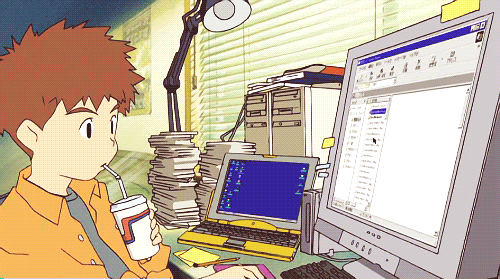

### Hello guys! o/
## I'm Rithie! Nice to meet ya!

#### :snowman: ---Profile---
- 🎓 BSc in Computer Science | PUC Minas, 2022
- 🎓 Postgraduate in Data Science & Big Data | PUC Minas, 2023
- ⏰ Master's Degree in Computer Science studies on pause | UFMG, 2024 - goes on hiatus in mid-2025
- 🌱 I’m currently learning and researching 6G mobile network
- 🎸 Havin fun playing guitar
- ⚡ Fun fact: As a left-handed guy, my first guitar was for a right-handed, so I needed to invert all strings
 
#### 📫 ---Where you can find me and contact---

> _Note: If you want to know how to put these cards like the ones below, check [anuraghazra repository](https://github.com/anuraghazra/github-readme-stats)!_

    
    

<!--
**rithienatan/rithienatan** is a ✨ _special_ ✨ repository because its `README.md` (this file) appears on your GitHub profile.

Here are some ideas to get you started:

- 🔭 I’m currently working on Hired, Corp. as Co-Founder & CTO
- 🌱 I’m currently learning ...
- 👯 I’m looking to collaborate on ...
- 🤔 I’m looking for help with ...
- 💬 Ask me about ...
- 📫 How to reach me: ...
- 😄 Pronouns: ...
- ⚡ Fun fact: ...
-->
